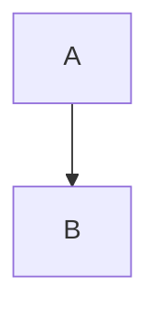

## test

1

<script src="https://cdn.jsdelivr.net/npm/mermaid/dist/mermaid.min.js"></script>
<script>
  document.addEventListener("DOMContentLoaded", function() {
    mermaid.initialize({ startOnLoad: true });
    // Преобразование блоков ```mermaid в div.mermaid
    document.querySelectorAll('pre code.language-mermaid').forEach((el) => {
      const div = document.createElement('div');
      div.className = 'mermaid';
      div.textContent = el.textContent;
      el.parentNode.replaceWith(div);
    });
  });
</script>



<script type="module">
	import mermaid from 'https://cdn.jsdelivr.net/npm/mermaid@10/dist/mermaid.esm.min.mjs';
	mermaid.initialize({
		startOnLoad: true,
		theme: 'dark'
	});
</script>

<pre class="mermaid">
flowchart TD
     C-->D
</pre>